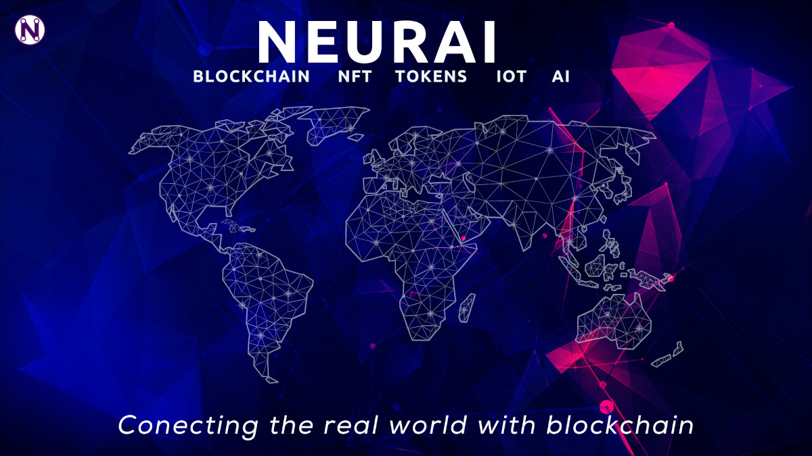

Neurai Core
=====================================




https://neurai.org

To see how to run Neurai, please read the respective files in [the doc folder](doc)


What is Neurai?
----------------
Neurai is a decentralized open source protocol optimized to transfer cryptoassets from one party to another on Layer1. The project aims to integrate NFT and Tokens with IoT and artificial intelligence applications.


Network Details
----------------
```
Network Name: Neurai
Network Abbreviation: XNA
Mining Algorithm:  KAWPOW Proof-of-work
Block Time: 1 minute
Initial Block Size: 8 MB
Block Reward Schedule: 50,000 XNA per block
Block Reward Micro-halvening: 10 days (5%)
Maximum Supply: 21,000,000,000 XNA
Decimal Places: 8
Launch Date: 2024-04-17 08:40 UTC
Genesis: Fortune 16/April/2023  Elon Musk agrees A.I. will hit people like an asteroid 

Main Network: 19000
Main RPC: 19001
Testnet Network: 19100
Testnet RPC: 19001
Regtest Network: 19200
Regtest RPC: 19201
```

License
-------

Neurai Core is released under the terms of the MIT license. See [COPYING](COPYING) for more
information or see https://opensource.org/licenses/MIT.


